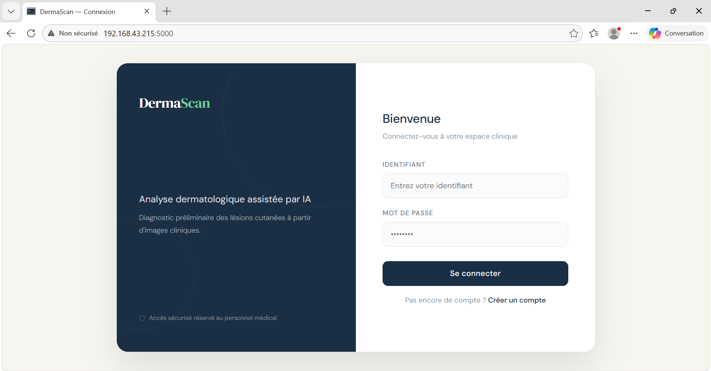
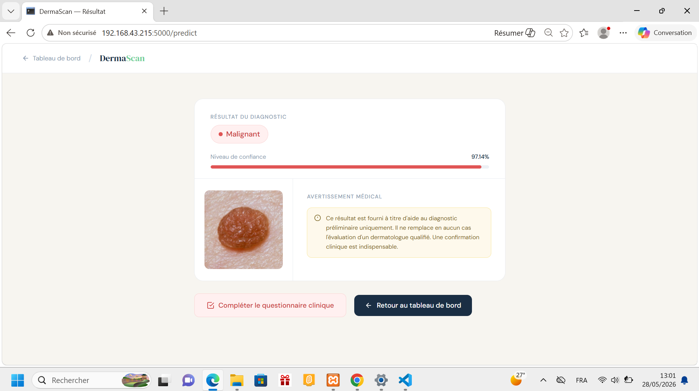

# DermaScan

> Système intelligent d'aide au dépistage dermatologique basé sur l'intelligence artificielle pour l'analyse préliminaire des lésions cutanées.

 **Dépôt GitHub :** [https://github.com/bluethread404/dermascan](https://github.com/bluethread404/dermascan)

---

## Aperçu de l'interface

| Tableau de bord | Connexion | Résultat IA |
|-----------------|-----------|-------------|
|  |  |  |

---

##  Démonstration

>  [Voir la vidéo de démonstration](docs/demo.mp4)

---

## Table des matières

* [Aperçu du projet](#aperçu-du-projet)
* [Fonctionnalités](#fonctionnalités)
* [Pipeline IA](#pipeline-ia)
* [Technologies utilisées](#technologies-utilisées)
* [Structure du projet](#structure-du-projet)
* [Installation](#installation)
* [Configuration de la base de données](#configuration-de-la-base-de-données)
* [Lancement de l'application](#lancement-de-lapplication)
* [Utilisation](#utilisation)
* [Points forts](#points-forts)
* [Améliorations futures](#améliorations-futures)
* [Avertissement médical](#avertissement-médical)
* [Licence](#licence)

---

##  Aperçu du projet

DermaScan est une application web médicale intelligente permettant l'analyse de lésions cutanées à partir d'images dermoscopiques.

Elle combine une interface web moderne et un modèle de deep learning pour fournir un **diagnostic préliminaire (bénin ou malin)** accompagné d'une évaluation du risque.

L'utilisateur peut :

* Téléverser une image dermatologique
* Obtenir une prédiction IA avec score de confiance
* Remplir un questionnaire clinique en cas de suspicion de malignité
* Consulter un rapport d'évaluation du risque
* Suivre l'historique complet des analyses patients

---

##  Fonctionnalités

###  Authentification sécurisée

* Inscription et connexion des utilisateurs
* Mots de passe hachés avec Werkzeug
* Gestion des sessions Flask

###  Diagnostic assisté par IA

* Modèle **VGG16** entraîné pour classifier les lésions :
  * Lésion bénigne
  * Lésion maligne
* Affichage du score de confiance de la prédiction

###  Questionnaire clinique dynamique

* Activé uniquement en cas de suspicion de malignité
* Évaluation symptomatique complémentaire en 7 questions

###  Évaluation du risque

* Trois niveaux de risque : **Faible**, **Modéré**, **Élevé**
* Recommandations cliniques personnalisées

### Gestion des patients

* Historique complet des analyses
* Stockage des résultats, scores et images

---

##  Pipeline IA

```
Téléversement de l'image
        ↓
Prétraitement (redimensionnement 224×224, normalisation)
        ↓
Analyse par le modèle VGG16
        ↓
Classification : Bénin / Malin
        ↓
Déclenchement conditionnel du questionnaire clinique
        ↓
Calcul du score de risque
        ↓
Stockage des résultats dans MySQL
```

---

##  Technologies utilisées

| Couche | Technologies |
|--------|-------------|
| Backend | Python, Flask |
| Intelligence artificielle | TensorFlow, Keras, VGG16 |
| Base de données | MySQL |
| Frontend | HTML5, CSS3, Bootstrap 5, Jinja2 |
| Traitement d'image | Pillow, NumPy |
| Authentification | Werkzeug |

---

##  Structure du projet

```
PROJET AI/
│
├── docs/
│   ├── screenshots/
│   │   ├── dashboard/
│   │   ├── login_et_inscription/
│   │   └── resultat_et_quiz/
│   │       ├── questions_du_quiz/
│   │       ├── resultat_du_quiz/
│   │       ├── benign_result.png
│   │       └── mlignant_result.png
│   └── demo.mp4
│
├── model/
│   └── vgg16_skin_cancer.h5        ← non inclus dans le dépôt
│
├── static/
│   ├── uploads/                    ← créé automatiquement
│   └── style.css
│
├── templates/
│   ├── dashboard.html
│   ├── login.html
│   ├── patients.html
│   ├── predict.html
│   ├── quiz_result.html
│   ├── register.html
│   ├── result.html
│   └── symptom_quiz.html
│
├── venv/
├── .gitignore
├── app.py
├── hash_password.py
├── mysql.sql
├── requirements.txt
└── README.md
```

---

##  Installation

### 1. Cloner le dépôt

```bash
git clone https://github.com/bluethread404/dermascan.git
cd dermascan
```

### 2. Créer et activer l'environnement virtuel

```bash
python -m venv venv
```

**Windows**
```bash
venv\Scripts\activate
```

**macOS / Linux**
```bash
source venv/bin/activate
```

### 3. Installer les dépendances

```bash
pip install -r requirements.txt
```

### 4. Ajouter le modèle IA

Le modèle VGG16 utilisé par DermaScan est disponible via Google Drive :
 [Télécharger le modèle IA](https://drive.google.com/drive/folders/18pLJRQe90d3akGIzFfAckJZFsxXgdQz8)

Après téléchargement, placez le fichier `.h5` dans le dossier suivant :

```bash
model/vgg16_skin_cancer.h5
```
> Le modèle est hébergé séparément du dépôt GitHub en raison de sa taille.

##  Configuration de la base de données

### 1. Importer le schéma SQL

```bash
mysql -u root -p < mysql.sql
```

### 2. Configurer la connexion dans `app.py`

```python
db = mysql.connector.connect(
    host="localhost",
    user="root",
    password="VOTRE_MOT_DE_PASSE",
    database="skin_cancer_db1"
)
```

### 3. Créer un compte administrateur

Générez un mot de passe haché :

```bash
python hash_password.py
```

Puis insérez l'utilisateur dans MySQL :

```sql
INSERT INTO users (username, password, role)
VALUES ('admin', 'HASH_GÉNÉRÉ_ICI', 'admin');
```

---

##  Lancement de l'application

```bash
python app.py
```

Ouvrez votre navigateur et accédez à :

```
http://localhost:5000
```

---

## Utilisation

1. Créez un compte ou connectez-vous
2. Accédez au tableau de bord
3. Téléversez une image de lésion cutanée
4. Consultez la prédiction IA et le score de confiance
5. Répondez au questionnaire clinique si la lésion est suspecte
6. Consultez le rapport d'évaluation du risque
7. Accédez à l'historique des patients

---

##  Points forts

* Analyse automatique des lésions cutanées par deep learning
* Modèle VGG16 avec score de confiance
* Questionnaire clinique dynamique en 7 étapes
* Système d'évaluation du risque à trois niveaux
* Interface web complète et responsive
* Historique des patients avec stockage des images

---

##  Améliorations futures

* Déploiement cloud (Render / Railway)
* API REST sécurisée
* Authentification JWT
* Explicabilité du modèle IA via Grad-CAM
* Export PDF des rapports médicaux
* Optimisation et réentraînement du modèle

---

##  Avertissement médical

DermaScan est un **outil d'aide au dépistage préliminaire uniquement**.

Il ne remplace en aucun cas le diagnostic d'un dermatologue ou d'un médecin qualifié. Toute décision médicale doit être validée par un professionnel de santé.

---

##  Licence

Projet réalisé à des fins éducatives et académiques.
