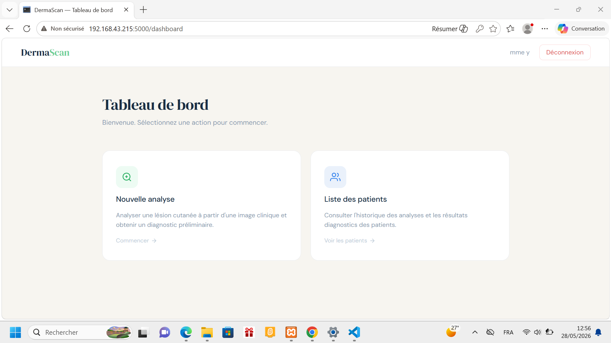

Voici le contenu du fichier `README.md` prêt à être enregistré.

```markdown
# DermaScan

> Système intelligent d’aide au dépistage dermatologique basé sur l’intelligence artificielle pour l’analyse préliminaire des lésions cutanées.

 **Lien du projet GitHub :** [https://github.com/bluethread404/dermascan](https://github.com/bluethread404/dermascan)

---

## Aperçu



---

##  Table des matières

* [Aperçu du projet](#aperçu-du-projet)
* [Fonctionnalités](#fonctionnalités)
* [Pipeline IA](#pipeline-ia)
* [Technologies utilisées](#technologies-utilisées)
* [Structure du projet](#structure-du-projet)
* [Installation](#installation)
* [Configuration de la base de données](#configuration-de-la-base-de-données)
* [Lancement de l’application](#lancement-de-lapplication)
* [Utilisation](#utilisation)
* [Améliorations futures](#améliorations-futures)
* [Avertissement médical](#avertissement-médical)
* [Licence](#licence)

---

##  Aperçu du projet

DermaScan est une application web médicale intelligente permettant l’analyse de lésions cutanées à partir d’images dermoscopiques.

Elle combine une interface web et un modèle de deep learning pour fournir un **diagnostic préliminaire (bénin ou malin)** accompagné d’une évaluation du risque.

L’utilisateur peut :

* Télécharger une image médicale
* Obtenir une prédiction IA
* Remplir un questionnaire clinique si suspicion de malignité
* Consulter un rapport de risque
* Suivre l’historique des patients

---

## Fonctionnalités

### Authentification sécurisée

* Inscription / connexion utilisateur
* Mots de passe hachés avec Werkzeug
* Gestion de sessions Flask

### Intelligence artificielle

* Modèle **VGG16** entraîné pour la classification :

  * Lésion bénigne
  * Lésion maligne
* Affichage du score de confiance

### Questionnaire clinique dynamique

* Activé uniquement si suspicion de malignité
* Évaluation complémentaire des symptômes

### Évaluation du risque

* Niveau de risque :

  * Faible
  * Modéré
  * Élevé
* Recommandations associées

### Gestion des patients

* Historique des analyses
* Stockage des résultats et images

---

##  Pipeline IA

1. Téléversement de l’image
2. Prétraitement
3. Analyse par modèle VGG16
4. Classification (bénin / malin)
5. Activation conditionnelle du questionnaire
6. Calcul du score de risque
7. Stockage dans MySQL

---

##  Technologies utilisées

* **Backend :** Python, Flask
* **IA :** TensorFlow, Keras (VGG16)
* **Base de données :** MySQL
* **Frontend :** HTML5, CSS3, Bootstrap
* **Traitement image :** Pillow, NumPy
* **Sécurité :** Werkzeug (hashing)

---

##  Structure du projet

```
PROJET AI/
│
├── docs/
│   ├── screenshots/
│   │   ├── dashboard/
│   │   ├── login_et_inscription/
│   │   └── resultat_et_quiz/
│   │       ├── questions_du_quiz/
│   │       ├── resultat_du_quiz/
│   │       ├── benign_result.png
│   │       └── malignant_result.png
│   └── demo.mp4
│
├── model/
│   └── vgg16_skin_cancer.h5
│
├── static/
│   ├── uploads/
│   │   ├── cancer_check.jfif
│   │   ├── essai_cancer_non.jpg
│   │   ├── essai_cancer_oui.jpg
│   │   └── IMG_20180128_112822_HDR.jpg
│   └── style.css
│
├── templates/
│   ├── dashboard.html
│   ├── login.html
│   ├── patients.html
│   ├── predict.html
│   ├── quiz_result.html
│   ├── register.html
│   ├── result.html
│   └── symptom_quiz.html
│
├── venv/
├── .gitignore
├── app.py
├── hash_password.py
├── mysql.sql
├── requirements.txt
└── README.md
```

---

##  Installation

### 1. Cloner le projet

```bash
git clone https://github.com/bluethread404/dermascan.git
cd dermascan
```

---

### 2. Créer un environnement virtuel

```bash
python -m venv venv
```

Activation :

```bash
venv\Scripts\activate
```

---

### 3. Installer les dépendances

```bash
pip install -r requirements.txt
```

---

### 4. Ajouter le modèle IA

Placer le fichier :

```
model/vgg16_skin_cancer.h5
```

---

##  Configuration de la base de données

Importer le script SQL :

```bash
mysql -u root -p < mysql.sql
```

Configurer la connexion dans `app.py` :

```python
db = mysql.connector.connect(
    host="localhost",
    user="root",
    password="VOTRE_MOT_DE_PASSE",
    database="skin_cancer_db1"
)
```

---

##  Lancement de l’application

```bash
python app.py
```

Puis accéder à :

```
http://localhost:5000
```

---

##  Utilisation

1. Créer un compte / se connecter
2. Accéder au tableau de bord
3. Importer une image de lésion
4. Consulter la prédiction IA
5. Répondre au questionnaire si nécessaire
6. Voir le rapport de risque
7. Consulter l’historique patient

---

##  Améliorations futures

* Déploiement cloud (Render / Railway)
* API REST sécurisée
* Authentification JWT
* Explicabilité IA (Grad-CAM)
* Export PDF des rapports
* Optimisation du modèle

---

##  Avertissement médical

DermaScan est un outil d’aide au dépistage préliminaire.

Il ne remplace en aucun cas un diagnostic médical professionnel.

---

##  Licence

Projet réalisé à des fins éducatives et académiques.
```
